<h3><code>samarth@github ~ $ ./contributions.sh</code></h3>

  

<h3><code>samarth@github ~ $ whoami</code></h3>

<table>
  <tr>
    <td valign="top">
      
    </td>
    <td valign="top">
      
    </td>
  </tr>
</table>

  

<h3><code>samarth@github ~ $ cat focus.txt</code></h3>

Computer Science graduate exploring quantitative research,
financial machine learning, low-latency systems and data-driven modelling.

 

<h3><code>samarth@github ~ $ ./links.sh</code></h3>

